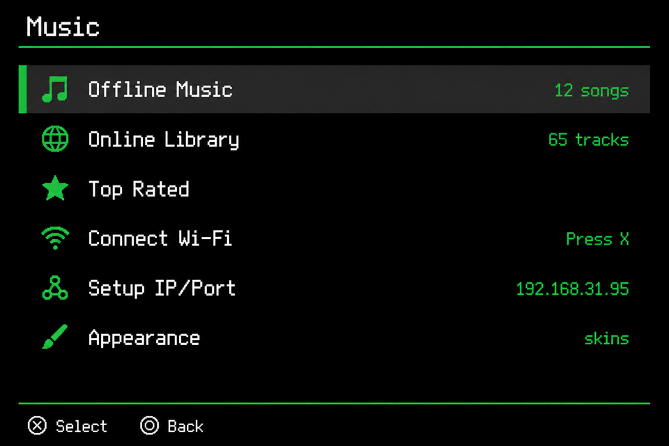
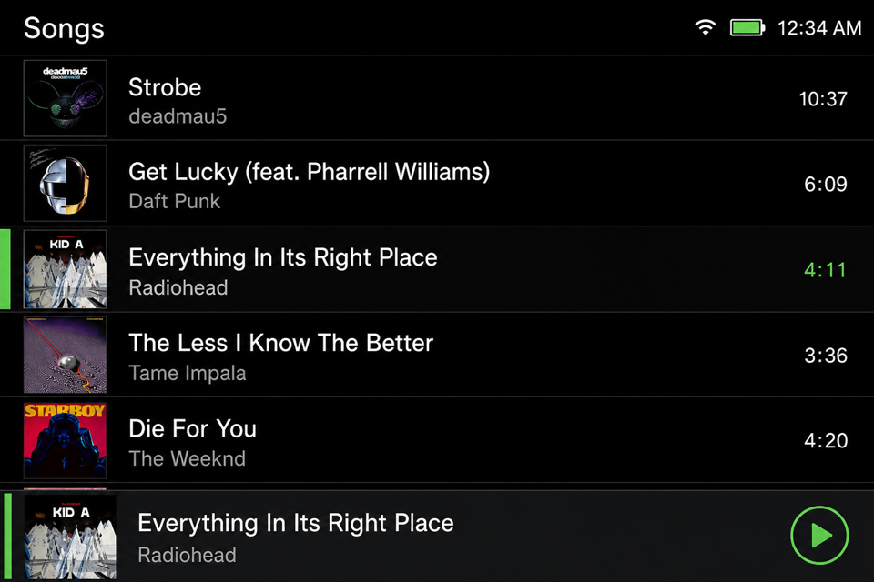
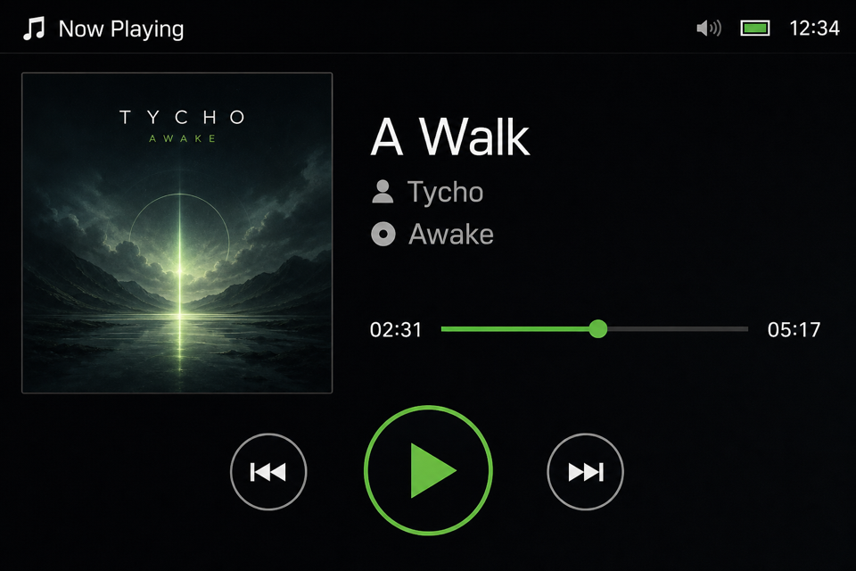
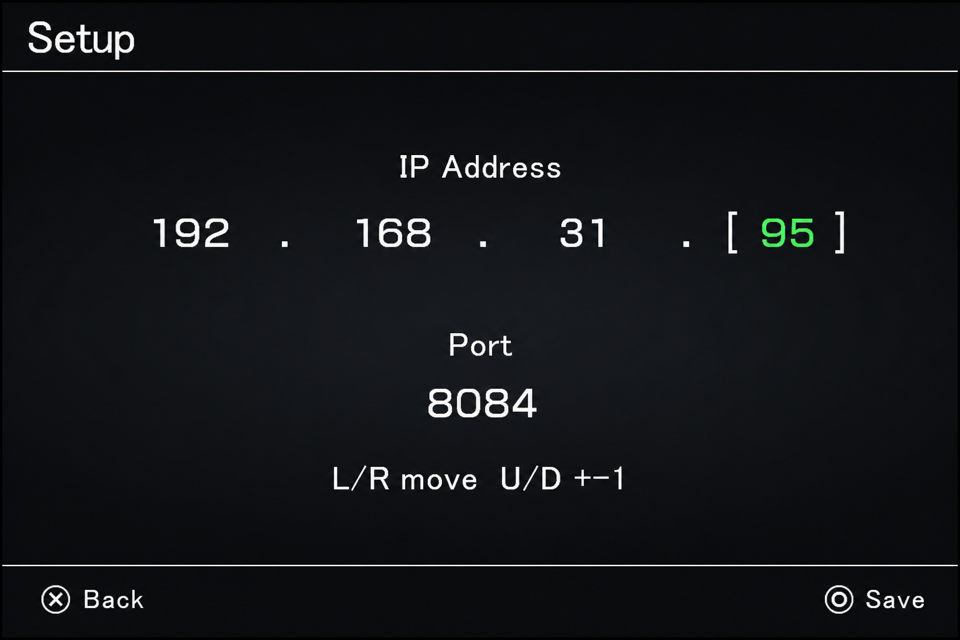

# PSP Music Online

**Language / Язык:** [English](#english) · [Русский](#russian)

**Download / Скачать:** [Releases](https://github.com/milkyhack/psp-music-online/releases) — ready `EBOOT.PBP` (player + Music Updater), no build needed.

---

## English

**PSP Music Online** — stream your PC music library to a real PSP over Wi‑Fi.

LAN only. Same Wi‑Fi. No cloud.

### Contents

- [Features](#features)
- [Screenshots](#screenshots)
- [Quick start (5 minutes)](#quick-start-5-minutes)
- [Controls](#controls)
- [Music Updater](#music-updater)
- [Audio quality](#audio-quality)
- [FAQ](#faq)
- [License](#license)

### Features

- **PC FastAPI server + PSP CFW homebrew client** — your library stays on your machine
- **Online stream** — FLAC / M4A / WAV are transcoded on the server to **MP3 320** for hardware `sceMp3`
- **MP3 sources** — passthrough (no extra re-encode)
- **Covers** — album art before and during playback
- **Browse & search** — artists, albums, tracks
- **Offline download** — save tracks to the Memory Stick, play without Wi‑Fi
- **Music Updater** — separate XMB icon: install if missing, update if old, or say you already have the latest
- **Themes / skins** — **Neon Terminal** (default, matches README gallery) plus Midnight and more in Appearance
- **Admin UI** — `http://IP:8084/` for scan, cache, and diagnostics

### Screenshots

<p align="center">
  
  &nbsp;
  
</p>

<p align="center">
  
  &nbsp;
  
</p>

| Screen | File |
|--------|------|
| Home | [`docs/assets/home.png`](docs/assets/home.png) |
| Library | [`docs/assets/library.png`](docs/assets/library.png) |
| Now Playing | [`docs/assets/now-playing.png`](docs/assets/now-playing.png) |
| Setup | [`docs/assets/setup.png`](docs/assets/setup.png) |

### Quick start (5 minutes)

#### What you need

| Item | Why |
|------|-----|
| PSP with CFW (ARK / PRO / Infinity, etc.) | Run homebrew |
| Memory Stick | Client + offline music |
| PC on the same Wi‑Fi | Server |
| Python 3.10+ | Server |
| ffmpeg (or `imageio-ffmpeg` from pip) | Transcode FLAC/M4A/WAV → MP3 |

#### 1. Start the server

```bash
git clone https://github.com/milkyhack/psp-music-online.git
cd psp-music-online/server

python3 -m venv .venv
source .venv/bin/activate          # Windows: .venv\Scripts\activate
pip install -r requirements.txt

cp .env.example .env
# Set MUSIC_DIR to your music folder, e.g.:
#   MUSIC_DIR=/Users/you/Music

python -m app
```

Open **http://127.0.0.1:8084/**

1. Click **Scan** (with covers).
2. Optionally **Warm cache** so the first tracks do not wait on ffmpeg.
3. Copy the status line like `192.168.x.x 8084` — that is the IP and port for the PSP.

> macOS may block inbound port 8084. Allow Python in Firewall. On Windows you can use `server/open_firewall_8084.bat`.

#### 2. Install the client (USB)

Easiest: download **`psp-music-online-*-memory-stick.zip`** from
[Releases](https://github.com/milkyhack/psp-music-online/releases), unzip, copy the `PSP/` folder to the Memory Stick root.

Or copy the files yourself:

```text
ms0:/PSP/GAME/PSPMUSIC/EBOOT.PBP      ← player
ms0:/PSP/GAME/PSPMUSICUPD/EBOOT.PBP   ← Music Updater
```

To build from source: `cd psp && make companion` ([pspdev](https://github.com/pspdev/pspdev)).

Next to the player, create `server.cfg` — one line:

```text
192.168.31.95 8084
```

Use **your** IP and port from the admin page.

Or on the PSP: **Setup IP/Port** → set octets → it saves automatically.

#### 3. Play

1. XMB → **Game** → **PSP Music**
2. **Connect Wi‑Fi** (X)
3. **Online Library** → pick a track → Play
4. For updates: open the **Music Updater** icon

### Controls

| Button | Where | Action |
|--------|-------|--------|
| **X** | Lists / Now Playing | Open / Play / Pause |
| **O** | Everywhere | Back (exit Updater) |
| **□** | Now Playing | Stop |
| **△** | Lists | Open Now Playing (or Home) |
| **D-pad L/R** | Now Playing | Skip track |
| **D-pad U/D** | Now Playing | Volume |
| **L / R** | Now Playing | Shuffle / Repeat |
| **SELECT** | Now Playing | Info → EQ → off |
| **SELECT** then **□** | Now Playing | Rate stars |
| **START** | Now Playing | Save offline |
| **SELECT** | Setup | Edit IP / port |

### Music Updater

Separate XMB app. Installs or updates **PSP Music**.

| State | Message | What to do |
|-------|---------|------------|
| Not installed | `not installed` | Press **X** to download |
| Outdated | `outdated` | Press **X** to update |
| Up to date | `You already have the latest version` | Press **O** to exit |

Paths:

```text
ms0:/PSP/GAME/PSPMUSIC/
ms0:/PSP/GAME/PSPMUSICUPD/
```

### Audio quality

| Source on PC | What the PSP hears (online) | Why |
|--------------|-----------------------------|-----|
| FLAC / M4A / WAV | **MP3 320 CBR**, 44.1 kHz stereo | Hardware `sceMp3` + stable Wi‑Fi |
| MP3 | Passthrough | No extra re-encode |

PSP Wi‑Fi (~802.11b) cannot hold a stable lossless stream. **MP3 320 is the practical ceiling for online playback.**

Local FLAC on the Memory Stick can play offline via soft decode — that path is separate from online streaming.

### FAQ

<details>
<summary><strong>Updater says “check failed”</strong></summary>

The server is down, or the PSP is on another network. From a phone on the same Wi‑Fi, open `http://IP:8084/api/client/update`. The IP in `server.cfg` must match the admin page.
</details>

<details>
<summary><strong>Silence / Loading never finishes</strong></summary>

1. In admin: **Scan** + **Warm cache**  
2. Confirm ffmpeg is available (`ffmpeg` on PATH or the pip package)  
3. Restart the server after code updates
</details>

<details>
<summary><strong>Mac does not see the Memory Stick</strong></summary>

On the PSP: **Settings → USB Connection**. If the volume appears as `NO NAME` and vanishes, check the **LOCK** switch on the card, reseat it, try USB again.
</details>

<details>
<summary><strong>Cannot delete files on the PSP</strong></summary>

Usually the Memory Stick / adapter is locked, or the FAT volume is dirty. That is not a player bug.
</details>

<details>
<summary><strong>Is this cloud / Spotify?</strong></summary>

No. Everything stays on your LAN. The server only serves **your** folders.
</details>

### License

**PMO-NC 1.0** — see [LICENSE](LICENSE).

Copyright (c) 2026 **milkyhack**.

| Allowed | Not allowed |
|---------|-------------|
| Free use, modify, fork | Sell the software or charge for copies |
| Free distribution | Remove copyright / origin notices |
| Public forks | Fork without linking the original |

**Required** on every fork and distribution:

1. Keep notices and the license text  
2. Credit **PSP Music Online** / milkyhack  
3. Link the original: https://github.com/milkyhack/psp-music-online  

Commercial use needs separate written permission from the copyright holder.

Sony, PlayStation, and PSP are trademarks of their respective owners. This project is unofficial homebrew.

[↑ Back to language switcher](#psp-music-online)

---

<a id="russian"></a>

## Русский

**PSP Music Online** — стрим своей музыки с ПК на настоящую PSP по Wi‑Fi.

Только LAN. Одна и та же сеть Wi‑Fi. Без облака.

### Содержание

- [Возможности](#возможности)
- [Скриншоты](#скриншоты)
- [Быстрый старт (5 минут)](#быстрый-старт-5-минут)
- [Управление](#управление)
- [Music Updater](#music-updater-1)
- [Качество звука](#качество-звука)
- [Частые вопросы](#частые-вопросы)
- [Лицензия](#лицензия)

### Возможности

- **Сервер FastAPI на ПК + CFW‑клиент на PSP** — библиотека остаётся у вас
- **Онлайн‑стрим** — FLAC / M4A / WAV на сервере перекодируются в **MP3 320** под аппаратный `sceMp3`
- **MP3‑файлы** — отдаются как есть (без лишнего перекодирования)
- **Обложки** — до и во время воспроизведения
- **Просмотр и поиск** — артисты, альбомы, треки
- **Офлайн** — скачивание на Memory Stick, затем без Wi‑Fi
- **Music Updater** — отдельная иконка в XMB: установит, если нет / обновит, если устарело / сообщит, что версия уже актуальная
- **Темы / скины** — по умолчанию **Neon Terminal** (как на скринах в README), плюс Midnight и другие в Appearance
- **Админка** — `http://IP:8084/` для сканирования, кэша и диагностики

### Скриншоты

<p align="center">
  
  &nbsp;
  
</p>

<p align="center">
  
  &nbsp;
  
</p>

| Экран | Файл |
|-------|------|
| Главный экран | [`docs/assets/home.png`](docs/assets/home.png) |
| Библиотека | [`docs/assets/library.png`](docs/assets/library.png) |
| Now Playing | [`docs/assets/now-playing.png`](docs/assets/now-playing.png) |
| Настройка | [`docs/assets/setup.png`](docs/assets/setup.png) |

### Быстрый старт (5 минут)

#### Что нужно

| Что | Зачем |
|-----|--------|
| PSP с CFW (ARK / PRO / Infinity и т.п.) | Запуск homebrew |
| Memory Stick | Клиент + офлайн‑музыка |
| ПК в той же сети Wi‑Fi | Сервер |
| Python 3.10+ | Сервер |
| ffmpeg (или `imageio-ffmpeg` из pip) | Перекодирование FLAC/M4A/WAV → MP3 |

#### 1. Запуск сервера

```bash
git clone https://github.com/milkyhack/psp-music-online.git
cd psp-music-online/server

python3 -m venv .venv
source .venv/bin/activate          # Windows: .venv\Scripts\activate
pip install -r requirements.txt

cp .env.example .env
# Укажи путь к музыке, например:
#   MUSIC_DIR=/Users/you/Music

python -m app
```

Открой **http://127.0.0.1:8084/**

1. Нажми **Scan** (с обложками).
2. По желанию **Warm cache** — чтобы первый трек не ждал ffmpeg.
3. Скопируй строку вида `192.168.x.x 8084` — это IP и порт для PSP.

> macOS иногда блокирует входящие подключения на порт 8084. Разреши Python в Firewall. На Windows можно запустить `server/open_firewall_8084.bat`.

#### 2. Клиент на PSP (USB)

Проще всего: скачай **`psp-music-online-*-memory-stick.zip`** из
[Releases](https://github.com/milkyhack/psp-music-online/releases), распакуй и скопируй папку `PSP/` в корень Memory Stick.

Или скопируй файлы вручную:

```text
ms0:/PSP/GAME/PSPMUSIC/EBOOT.PBP      ← плеер
ms0:/PSP/GAME/PSPMUSICUPD/EBOOT.PBP   ← Music Updater
```

Сборка из исходников: `cd psp && make companion` ([pspdev](https://github.com/pspdev/pspdev)).

Рядом с плеером создай `server.cfg` — одна строка:

```text
192.168.31.95 8084
```

Подставь **свой** IP и порт из админки.

Или на PSP: **Setup IP/Port** → задай октеты → сохранится автоматически.

#### 3. Играй

1. XMB → **Game** → **PSP Music**
2. **Connect Wi‑Fi** (X)
3. **Online Library** → трек → Play
4. Для обновлений: иконка **Music Updater**

### Управление

| Кнопка | Где | Действие |
|--------|-----|----------|
| **X** | Списки / Now Playing | Открыть / Play / Pause |
| **O** | Везде | Назад (выход из Updater) |
| **□** | Now Playing | Стоп |
| **△** | Списки | Now Playing (или Home) |
| **D-pad L/R** | Now Playing | Предыдущий / следующий трек |
| **D-pad U/D** | Now Playing | Громкость |
| **L / R** | Now Playing | Shuffle / Repeat |
| **SELECT** | Now Playing | Инфо → EQ → выкл. |
| **SELECT** затем **□** | Now Playing | Оценка звёздами |
| **START** | Now Playing | Сохранить офлайн |
| **SELECT** | Setup | Редактировать IP / порт |

### Music Updater

Отдельное приложение в XMB. Устанавливает или обновляет **PSP Music**.

| Состояние | Сообщение | Что делать |
|-----------|-----------|------------|
| Нет приложения | `not installed` | **X** — скачать |
| Устаревшая версия | `outdated` | **X** — обновить |
| Актуальная версия | `You already have the latest version` | **O** — выйти |

Пути:

```text
ms0:/PSP/GAME/PSPMUSIC/
ms0:/PSP/GAME/PSPMUSICUPD/
```

### Качество звука

| Источник на ПК | Что слышит PSP (онлайн) | Почему так |
|----------------|-------------------------|------------|
| FLAC / M4A / WAV | **MP3 320 CBR**, 44.1 kHz stereo | Аппаратный `sceMp3` + стабильный Wi‑Fi |
| MP3 | Как есть (passthrough) | Без лишнего перекодирования |

Wi‑Fi PSP (~802.11b) не обеспечивает стабильный lossless‑стрим. **MP3 320 — практический потолок для онлайна.**

Локальный FLAC на Memory Stick может играть офлайн через программный (soft) декод — это отдельный путь, не онлайн‑стрим.

### Частые вопросы

<details>
<summary><strong>Updater: «check failed»</strong></summary>

Сервер не запущен или PSP в другой сети. С телефона в той же сети Wi‑Fi открой `http://IP:8084/api/client/update`. IP в `server.cfg` должен совпадать с админкой.
</details>

<details>
<summary><strong>Тишина / Loading зависает</strong></summary>

1. В админке: **Scan** + **Warm cache**  
2. Убедись, что ffmpeg доступен (`ffmpeg` в PATH или pip‑пакет)  
3. Перезапусти сервер после обновления кода
</details>

<details>
<summary><strong>Mac не видит Memory Stick</strong></summary>

На PSP: **Settings → USB Connection**. Если том `NO NAME` мелькает и пропадает — проверь переключатель **LOCK** на карте, вынь и вставь снова, повтори USB.
</details>

<details>
<summary><strong>Файлы на PSP не удаляются</strong></summary>

Чаще всего LOCK на Memory Stick / адаптере или «грязная» FAT. Это не баг плеера.
</details>

<details>
<summary><strong>Это облако / Spotify?</strong></summary>

Нет. Всё работает только в LAN. Сервер отдаёт только **ваши** папки.
</details>

### Лицензия

**PMO-NC 1.0** — см. [LICENSE](LICENSE).

Copyright (c) 2026 **milkyhack**.

| Можно | Нельзя |
|-------|--------|
| Бесплатно пользоваться, менять, делать форк | Продавать софт / брать деньги за копии |
| Распространять бесплатно | Убирать копирайт и указание происхождения |
| Делать публичный форк | Форк без ссылки на оригинал |

**Обязательно** в любом форке и при любом распространении:

1. Сохранить уведомления об авторских правах и текст лицензии  
2. Указать, что проект основан на **PSP Music Online** / milkyhack  
3. Дать явную ссылку: https://github.com/milkyhack/psp-music-online  

Коммерческое использование — только по отдельному письменному разрешению правообладателя.

Sony, PlayStation и PSP — торговые марки правообладателей. Проект неофициальный.

[↑ К переключателю языка](#psp-music-online)
